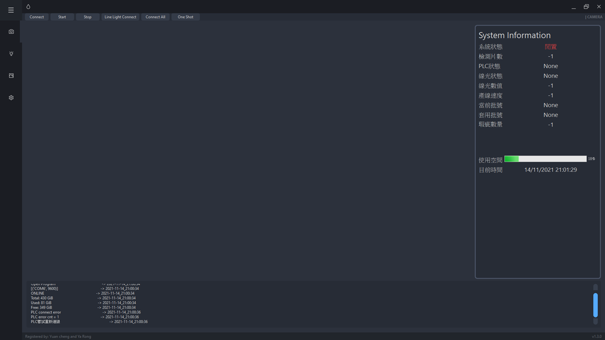
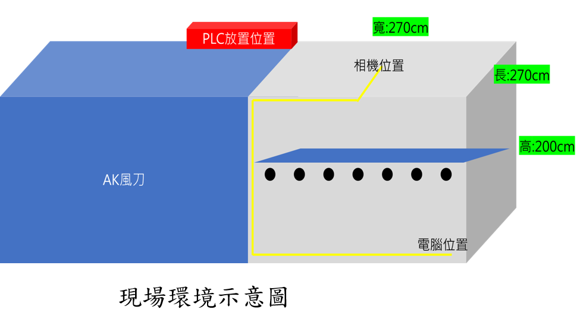
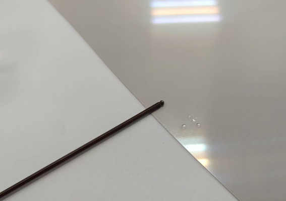
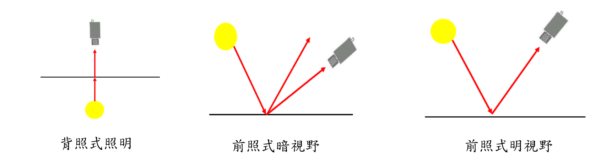
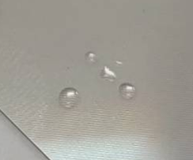
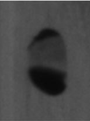
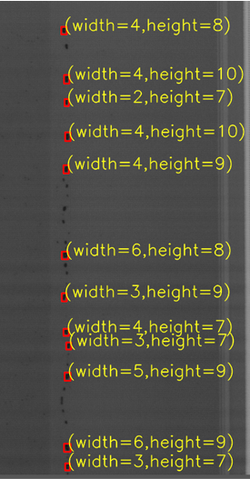
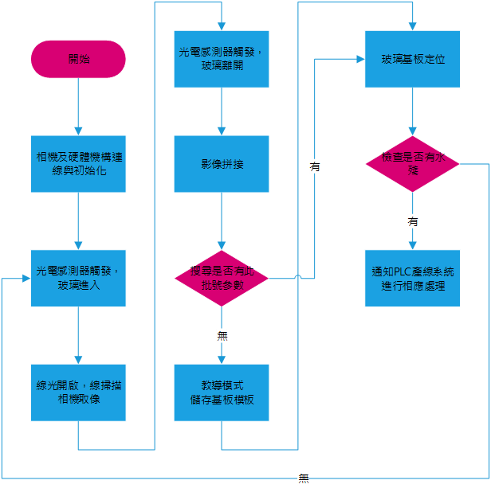

AOI project:檢測面板上是否殘留水珠

合作廠商:面板生產廠商

光學架構設計:背光、亮場、暗場

機構架設位置:生產線

<figure>

  

<figcaption align = "center"><b>主介面</b></figcaption>

</figure>

<figure>

  

<figcaption align = "center"><b>生產線示意圖</b></figcaption>

</figure>

<figure>

  

<figcaption align = "center"><b>待測物</b></figcaption>

</figure>

<figure>

  

<figcaption align = "center"><b>光學架設比較</b></figcaption>

</figure>

<figure>

  
  

<figcaption align = "center"><b>之前之後拍攝比較</b></figcaption>

</figure>

<figure>

  

<figcaption align = "center"><b>影像處理檢測結果</b></figcaption>

</figure>

<figure>

  

<figcaption align = "center"><b>系統流程圖</b></figcaption>

</figure>